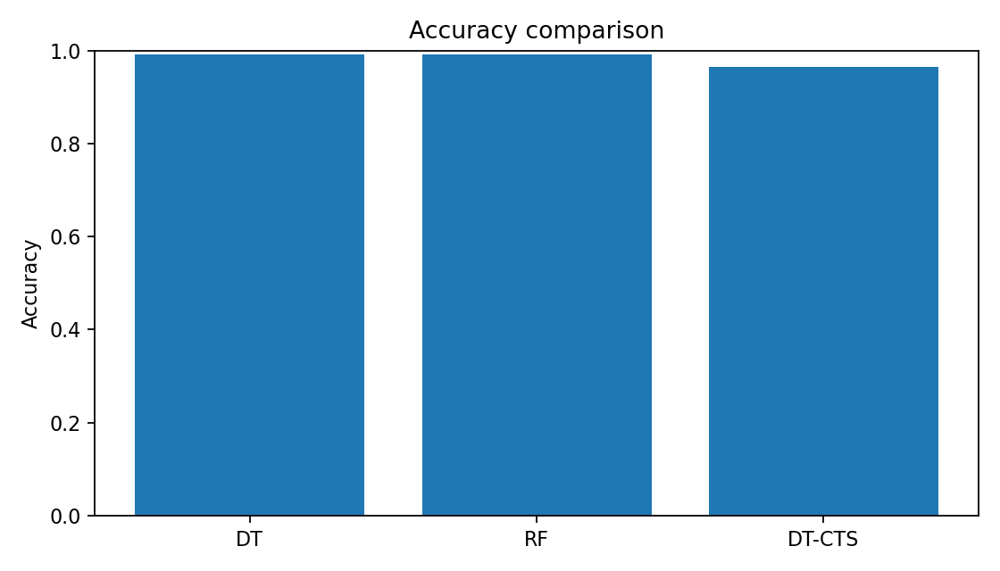
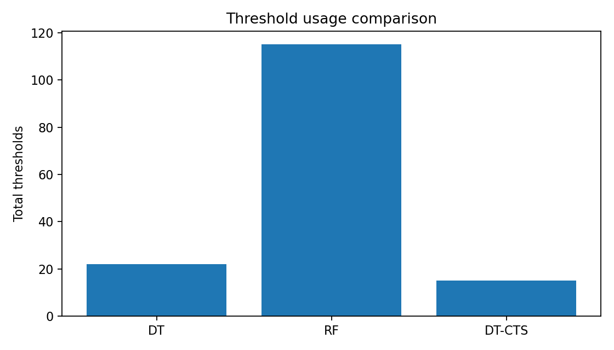
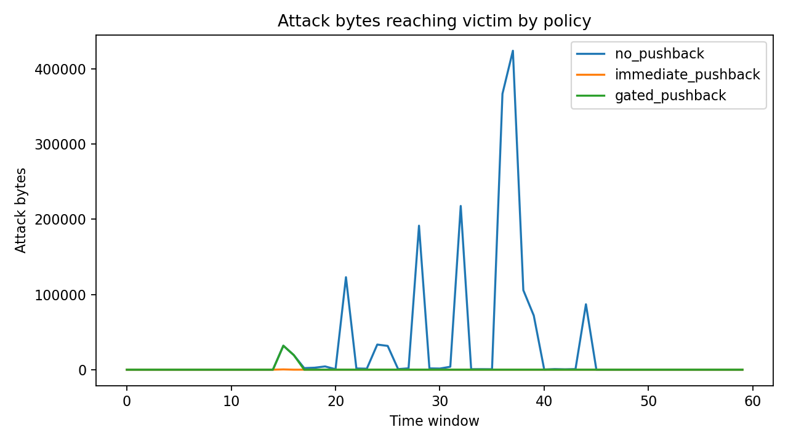

# Thông tin bài báo

- **Paper**: *SISTAR: An Efficient DDoS Detection and Mitigation Framework Utilizing Programmable Data Planes*
- **Venue**: ACM CCS 2025
- **Ý tưởng cốt lõi**: đưa phát hiện DDoS và pushback xuống **data plane** của switch lập trình được
- **Mục tiêu**: giữ **độ chính xác cao**, nhưng dùng **ít tài nguyên switch** và hỗ trợ **phòng thủ phân tán**

# Bài toán paper giải quyết là gì?

- Phát hiện và giảm thiểu **DDoS** ngay trong mạng, thay vì đẩy nhiều việc lên server hay control plane
- Xử lý cả:
  - **flooding attacks**: SYN/UDP/ICMP flood
  - **application-layer / protocol-based attacks**
- Bối cảnh khó:
  - switch có tài nguyên **SRAM/TCAM/stage** hữu hạn
  - mô hình ML mạnh thường tốn nhiều threshold, rule và bảng
  - phòng thủ một switch đơn lẻ không đủ cho tấn công phân tán

# Mô hình đe dọa (rút ra từ paper)

- Kẻ tấn công bơm lưu lượng độc hại từ nhiều nguồn vào mạng để làm cạn tài nguyên máy chủ / đường truyền
- Lưu lượng đi qua các switch lập trình được trong topo kiểu **gateway leaf → spine → server leaf**
- Tấn công gồm:
  - volumetric flooding
  - application-layer attacks như **GoldenEye, Hulk, SlowHTTP, Slowloris, Heartbleed**
- Mục tiêu của defender:
  - phát hiện sớm trên đường đi của gói tin
  - đẩy việc chặn lưu lượng lên **upstream switch** gần nguồn hơn

# Giả định của paper

- Mạng nằm trong **một miền quản trị thống nhất** (single administrative domain)
- Có nhiều **programmable switch** hỗ trợ P4 / PISA
- Có thể tính được một số đặc trưng packet-level và flow-level ngay trong data plane
- Các switch có thể gửi cho nhau **alert packet** với custom header
- Có thể **huấn luyện lại** mô hình khi gặp dạng tấn công mới
- Paper **không** giả định dùng payload inspection sâu; chủ yếu dựa vào header + flow statistics

# Vì sao bài toán khó?

- **Trade-off accuracy vs. resource**:
  - nhiều feature hơn → chính xác hơn
  - nhưng cũng tốn nhiều register, table entry và stage hơn
- **Mapping ML sang switch** không tự nhiên:
  - decision tree / random forest có nhiều threshold
  - threshold nhiều → encoding dài → bảng lớn
- **Phòng thủ hợp tác** giữa nhiều switch khó hơn phát hiện tại một điểm

# Ý tưởng chính của SISTAR

1. Chọn tập feature nhỏ nhưng hữu ích, gồm cả **packet-level** và **flow-level**
2. Dùng **DT-CTS** để giảm số threshold của decision tree
3. Mã hóa đặc trưng thành **bit / ternary match** để ánh xạ sang bảng P4
4. Triển khai mô hình **phân tán**:
   - switch gần gateway: mô hình nhẹ, phát hiện nhanh
   - switch gần core/spine: mô hình mạnh hơn, phân tích sâu hơn
5. Khi phát hiện tấn công, gửi **alert** và kích hoạt **pushback** lên upstream switch

# DT-CTS là gì?

- DT-CTS = **Decision Tree with Constrained Threshold Segmentation**
- Khác với cây quyết định thường:
  - mỗi feature bị **giới hạn số threshold tối đa** khi xây cây
- Ý nghĩa:
  - giảm số node / split dư thừa
  - giảm số điều kiện cần so khớp trên switch
  - giúp mô hình dễ encode hơn vào **match-action table**
- Trực giác:
  - thay vì tối ưu cây chỉ theo độ chính xác
  - paper tối ưu cây theo **khả năng triển khai trên phần cứng mạng**

# Cách mapping mô hình sang data plane

- Mỗi feature được chia theo các threshold thành các khoảng
- Mỗi khoảng được mã hóa thành một mã nhị phân ngắn
- Ghép các mã feature thành một vector `bin_feature`
- Dùng **ternary match** để ánh xạ từ vector mã hóa sang nhãn / action
- Lợi ích:
  - giảm số stage cần dùng
  - giảm số table entry
  - phù hợp pipeline match-action của P4 switch

# Cơ chế triển khai phân tán và pushback

- Nếu gói bình thường: forward như thường lệ
- Nếu gói đáng ngờ:
  - switch tạo **alert packet**
  - switch khác dùng alert này để tăng cảnh giác / cài thêm rule
- Khi mức cảnh báo vượt ngưỡng:
  - hệ thống **pushback** lên upstream switch
  - chặn / giảm lưu lượng gần nguồn tấn công hơn
- Ý nghĩa:
  - giảm tải cho server đích
  - giảm băng thông độc hại trên các link phía sau

# Thiết lập đánh giá trong paper

- **Mô hình**: DT, DT-CTS, RF, RF-CTS, XGBoost
- **Dataset**: 6 bộ dữ liệu
  - CIC-IDS2017
  - CIC-IDS2018
  - CIC-DDoS2019
  - CICIoT2023
  - IoT23
  - UNSW-NB15
- **Nền tảng**:
  - Tofino hardware switch
  - BMv2 software switch
- **Chỉ số**:
  - Accuracy, F1
  - số threshold
  - SRAM / TCAM / stage / table / table entry
  - throughput, latency
  - hiệu quả pushback

# Kết quả chính trong paper

- **DT-CTS giảm threshold tới ~70%** mà vẫn giữ độ chính xác cao
- Chỉ với **3 feature**, paper báo cáo đạt khoảng **98% F1**
- Trên nhiều dataset, bản CTS giữ accuracy/F1 gần mô hình gốc; suy giảm thường **≤ 1%**
- Phát hiện trên topo phân tán:
  - **>95%** với traffic DDoS thực
  - **99.7%** với traffic mô phỏng
- **Pushback** giảm attack traffic bandwidth utilization tới khoảng **40%**
- Độ trễ vẫn thấp, khoảng **820–920 ns**, và giữ line-rate trên Tofino

# Dấu hiệu hiệu quả về tài nguyên trong paper

- SRAM của SISTAR khoảng **2.9%**
- TCAM khoảng **2.1%**
- `tMatch xBar` khoảng **1.8%**
- Chỉ dùng khoảng **6 stages** và **7 tables**
- Số table entry thấp hơn nhiều hướng tiếp cận khác khi đạt mức accuracy tương đương
- Đây là điểm mạnh thực sự của paper: **không chỉ chính xác mà còn deployable**

# Phần ý tưởng nào có thể hiện thực hóa trong repo này?

- Repo hiện có một bản **reproduction rút gọn** của SISTAR
- Phần đã có thể demo tốt:
  1. so sánh **DT / RF / DT-CTS**
  2. đo **threshold-count** như proxy cho chi phí triển khai
  3. mô phỏng **pushback** trên tuyến 3-hop
- Phần **chưa** tái hiện đầy đủ như paper:
  - không chạy thật trên Tofino
  - không dựng đầy đủ BMv2/P4Runtime trong thí nghiệm cuối
  - không đo chính xác resource counter phần cứng

# Hướng dẫn hiện thực hóa một phần ý tưởng paper

- Chạy reproduction rút gọn:

```bash
python3 /home/team/NT140.Q21.ANTN/Final/reproduction/src/run_reproduction.py
```

- Script sẽ:
  - ưu tiên dataset `CICIDS2017 Wednesday`
  - train `DT`, `RF`, `DT-CTS`
  - xuất metric, threshold và mô phỏng pushback
- Kết quả nằm ở:
  - `reproduction/output/classification_metrics.csv`
  - `reproduction/output/threshold_metrics.csv`
  - `reproduction/output/pushback_metrics.csv`
  - `reproduction/output/*.png`

# Kết quả hiện thực rút gọn trong repo

- Dataset thực tế được dùng: **CICIDS2017 Wednesday subset**
- Kết quả chạy hiện tại:
  - **DT**: accuracy `0.9912`, F1 `0.9912`
  - **RF**: accuracy `0.9912`, F1 `0.9912`
  - **DT-CTS**: accuracy `0.9640`, F1 `0.9646`
- Threshold count:
  - **DT**: `22`
  - **DT-CTS**: `15`
  - giảm khoảng **31.8%** so với DT
- Kết luận: bản tái hiện rút gọn vẫn cho thấy **đổi accuracy lấy deployability**, nhưng chưa đạt mức paper công bố

{width=70%}

# Kết quả hiện thực rút gọn: hiệu quả threshold và pushback

- Mô phỏng pushback:
  - **no_pushback**: attack bytes tới nạn nhân ≈ `1,731,491`
  - **gated_pushback**: còn ≈ `51,302`
  - giảm khoảng **97.0%** trong mô phỏng rút gọn
- Nhưng `immediate_pushback` gây nhiều false block hơn
- `gated_pushback` là cải tiến nhỏ hợp lý để giảm block nhầm

{width=62%}

{width=62%}

# Ưu điểm của ý tưởng

- **Đúng bài toán hệ thống**: không chỉ hỏi “mô hình nào chính xác hơn?” mà hỏi “mô hình nào chạy được trên switch?”
- Tận dụng được lợi thế của **programmable data plane**: gần nguồn, độ trễ thấp, line-rate
- Có cơ chế **phòng thủ phân tán**, hợp lý hơn so với chặn tại server đích
- DT-CTS là đóng góp thực tế vì gắn trực tiếp với ràng buộc phần cứng
- Có khả năng mở rộng bằng cách cập nhật encoding / rule thay vì phải thiết kế lại toàn bộ pipeline

# Hạn chế và điểm cần phê bình

- Paper chưa đưa ra một **threat model hình thức** thật chặt; phần này chủ yếu phải suy ra từ mô tả hệ thống
- Hiệu quả phụ thuộc mạnh vào:
  - feature được chọn
  - dataset huấn luyện
  - topo triển khai
- Khi gặp **attack mới**, hệ thống vẫn cần **retrain**
- Alert/pushback có thể bị lạm dụng:
  - alert storm
  - forged alert packet
  - threshold inference / evasion
- Bản reproduction rút gọn của repo cho thấy khi đưa về môi trường đơn giản hơn, **DT-CTS không tự động thắng về accuracy**

# Mức độ phù hợp trong bối cảnh thực tế

- **Phù hợp cao** nếu:
  - bạn có programmable switch thật hoặc lab P4/BMv2
  - mạng nằm trong một domain quản trị
  - cần phát hiện sớm ở edge / gateway
- **Phù hợp trung bình** nếu:
  - hạ tầng hiện tại chủ yếu là switch thường
  - đội vận hành chưa sẵn năng lực P4 / Tofino
- **Ít phù hợp** nếu:
  - môi trường thay đổi liên tục, attack mới xuất hiện thường xuyên nhưng không có pipeline retraining tốt
  - không kiểm soát được hạ tầng upstream để pushback

# Đề xuất demo / báo cáo môn học

- Nên tách rõ **2 tầng kết luận**:
  1. **Paper claim**: SISTAR rất mạnh trên PDP thực, tối ưu tốt tài nguyên
  2. **Repo reproduction**: mới tái hiện được phần lõi ý tưởng, chưa tái hiện toàn bộ phần cứng mạng
- Demo hợp lý nhất:
  - chạy `run_reproduction.py`
  - trình bày bảng metric + threshold
  - giải thích vì sao `gated_pushback` giảm false block tốt hơn `immediate_pushback`
- Nếu có thêm thời gian, phần mở rộng tốt nhất là:
  - tune ngưỡng pushback
  - so sánh theo từng loại attack
  - nối với BMv2/P4 trong thư mục `SISTAR/`

# Kết luận

- SISTAR là một ý tưởng **mạnh về mặt hệ thống**: cân bằng giữa **accuracy, resource efficiency, và distributed defense**
- Đóng góp đáng giá nhất là **DT-CTS + feature encoding + pushback phân tán**
- Trong repo hiện tại, ta có thể hiện thực hóa được **một phiên bản rút gọn nhưng thuyết phục** để minh họa ý tưởng paper
- Thông điệp chính khi trình bày: **paper không chỉ phát hiện DDoS tốt, mà còn thiết kế để triển khai được trên switch thật**
